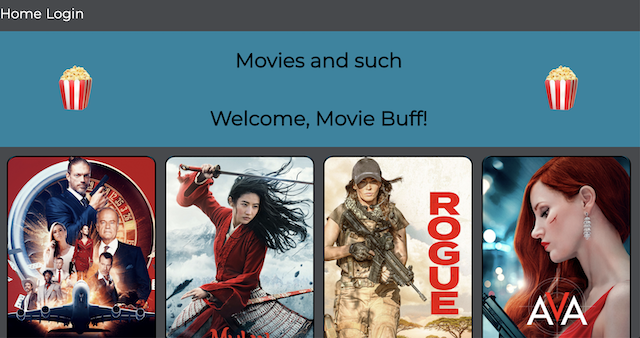
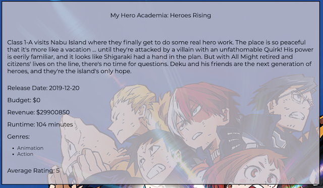

# RancidTomatillos

## What is this?

- Rancid Tomatillos is a Mod3 paired project for the Front End Engineering program at the Turing School of Software and Design. The project theme takes its inspiration from the movie rating site, Rotten Tomatoes. In this project, students were expected to develop an app using React complete with React Router, robust testing, and styling via CSS.

## Who was involved?

- [Tim Keresey](https://github.com/timkeresey)
- [Stacy Potten](https://github.com/stacyp2006)

## Installation

- Clone down the repo
- Run `npm install`
- Run `npm start`

## Technologies used

- [React](https://reactjs.org/)
  - JSX
- [React Testing Library](https://testing-library.com/docs/react-testing-library/intro)
- [Jest](https://jestjs.io/)
- [CSS](https://en.wikipedia.org/wiki/CSS)
- [Lighthouse](https://developers.google.com/web/tools/lighthouse)

## Accomplishments

- While we feel that there could be improvement to our overall application architecture, we do feel like we implemented React and React Router well for our first project with those technologies. We did a great deal of self teaching/learning in regard to implementing new tech. The UI and UX is relatively smooth. We paired together well as a team and bounced ideas off of one another in a respectful and productive way.

## Challenges

- Testing was the biggest challenge on this project. It was initially difficult to wrap our heads around where and how tests should be best implemented. We need more time to solidify our learning and understanding of these concepts. Additionally, we eventually gained a better understanding of how to cleanly and efficiently pass state down. We look forward to using what we've learned from this project on future challenges.

## Future Iterations

### Comments

- In a future iteration, we would like to implement commenting functionality. For example, a user should be able to navigate to a single movie show page and view all comments available for the movie. If the user is logged in, they should also be able to utilize a form to add their own comment.

### Favorites and Filtering

- Additionally, we would like users to be able to favorite movies and filter the view so they see only their favorite movies. The ability to do this would be based on their login status.

### Error Handling

- While we do have some instances of error handling, we would like to add more frequent and robust error handling to the application. Specifically, for instances when response is a non-200 status code and in API call functionality.

## In Action

### Home View

### Movie View

### Login Action

### Rating Action

